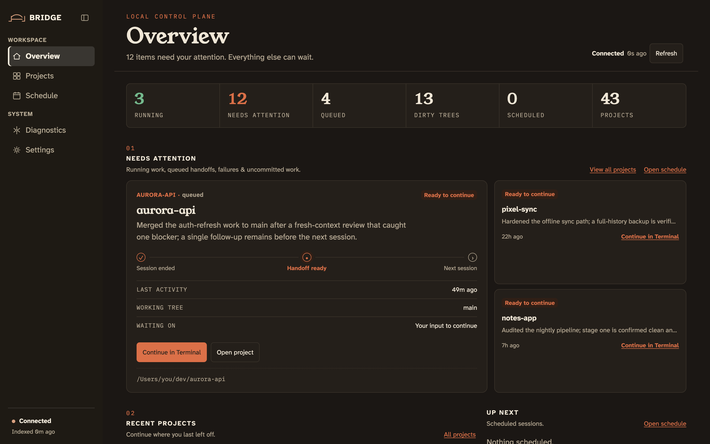

# Bridge

[](https://github.com/mit112/bridge/actions/workflows/ci.yml)
[](LICENSE)
[](https://www.python.org/downloads/release/python-3130/)



Running several Claude Code sessions across several project directories loses
the thread fast: which repo is mid-session, which one has a next step queued,
which one has uncommitted changes sitting stale. Bridge is a local dashboard
that answers those questions at a glance and gives every project a place to
keep its next-session prompt, so picking up a session is a click instead of a
memory exercise.

**macOS only.** Bridge uses `osascript` to spawn Terminal windows and runs as a
LaunchAgent. There is no Linux or Windows support.

## Quick start

```bash
# 1. Install
uv tool install git+https://github.com/mit112/bridge

# 2. Set up (interactive — takes ~1 minute)
bridge setup

# 3. Index your transcripts
bridge index

# 4. Open the panel
bridge open
```

### Or install with Homebrew

```bash
brew tap mit112/bridge
brew install --HEAD bridge
```

Bridge has no tagged releases, so the formula only supports `--HEAD` — it
builds from `main`, same as the `uv tool install` path above. `bridge update`
detects a Homebrew install and runs `brew upgrade --fetch-HEAD mit112/bridge/bridge`
for you instead of the `uv` path. Note that a plain `brew upgrade` will **not**
advance Bridge — always use `bridge update` (or `brew upgrade --fetch-HEAD`).

**Rollback is not supported on the Homebrew path.** If an update leaves Bridge
broken, reinstall via `uv` instead:

```bash
brew uninstall bridge
uv tool install git+https://github.com/mit112/bridge
```

`bridge setup` walks you through everything: it finds your project directories,
picks a port, optionally installs the `/handoff` slash command, and optionally
sets up a LaunchAgent so the panel stays running.

## What you get

- **Dashboard** at http://127.0.0.1:8787 — every Claude Code project as a card
  showing git branch/dirtiness, last session, token usage sparklines, and live
  session status
- **Handoff loop** — end a session with `/handoff` to capture a summary and
  next-session prompt; launch it from the card with one click
- **Launch bar** — pick model, effort, and permission mode per launch
- **Live updates** — SSE-pushed liveness, git state, and diagnostics
- **Scheduled runs** — set a time and Bridge launches the session for you
- **Self-updating** — the panel tells you when it's behind `main`; one click
  or `bridge update` installs it

## Staying up to date

Bridge tracks `main`. It checks for updates by asking GitHub for the latest
commit with `git ls-remote` — no GitHub token is collected or stored, and no
data about you is sent. When a newer commit is available the panel shows an
"update available" banner (`<from-sha> → <to-sha>`); click **Update now**, or
run:

```bash
bridge update
```

Either path installs the **exact** commit the check surfaced — never a
floating ref. What "installs" means depends on how Bridge is running:

- **`uv tool install`**: `bridge update` reinstalls that exact SHA and
  verifies a freshly launched process reports it, rolling back to the
  previous SHA on mismatch.
- **Homebrew (`--HEAD`)**: `bridge update` runs
  `brew upgrade --fetch-HEAD mit112/bridge/bridge`; there's no rollback, so a
  mismatch prints the manual recovery command instead.
- **Managed LaunchAgent** (installed via `bridge setup`): a one-shot updater
  job does the install and then restarts the panel itself, so the panel comes
  back on the new code without you doing anything.
- **Plain `bridge serve`** (no LaunchAgent): the install happens, but nothing
  restarts the running process for you — restart it by hand (`Ctrl-C`, then
  `bridge serve` again) to pick up the new code.

To disable update checks entirely, add to `~/.bridge/config.toml`:

```toml
[update]
enabled = false
```

`bridge setup` prints this same note during first-time setup.

## Prerequisites

- macOS (Bridge uses `osascript` and LaunchAgents)
- Python ≥ 3.13
- [uv](https://docs.astral.sh/uv/) (for `uv tool install`)
- [Claude Code](https://claude.ai/code) (`claude` on your PATH)

## Install from source (for contributors)

```bash
git clone https://github.com/mit112/bridge.git
cd bridge
uv sync --extra dev
uv run bridge setup
```

`uv sync` does not put `.venv/bin` on your PATH, so use `uv run bridge …` (or
activate the venv) when working from a clone.

## The handoff loop

End a Claude Code session by running `/handoff`. It composes a summary and a
next-session prompt and records them against the current project. `bridge next`
prints the prompt back, so `claude "$(bridge next)"` opens the next session on it.

`bridge setup` installs the slash command for you (`~/.claude/commands/handoff.md`).
To install it manually, from a clone of this repo:

```bash
mkdir -p ~/.claude/commands
cp commands/handoff.md ~/.claude/commands/handoff.md
```

The handoff is durable: if the panel is down, `bridge handoff` spools the prompt
to `~/.bridge/spool/` and the server ingests it on the next boot.

## Launching a session

Press ▶ on a card to open the queued prompt as a real session in a new Terminal
window, with the model and effort chosen beside the button. From the shell:

```bash
bridge launch [--project P] [--mode terminal|background] [--model M] [--effort E]
```

## Configuration

`~/.bridge/config.toml` (created by `bridge setup`, optional):

```toml
# Directories to scan one level deep for git repos.
# Bridge auto-discovers these during `bridge index`.
[discovery]
paths = ["~/dev", "~/work"]

# Map old project paths to current ones so a moved project
# still shows as a single card.
[aliases]
"/Users/you/old-path" = "/Users/you/new-path"

# Paths to archive on first indexing (hide from the main list).
[archived]
paths = ["~/dev/retired-project"]

# Hours after which an uncommitted change becomes "stale".
[stale]
hours = 12

# Port the panel listens on (default 8787).
# BRIDGE_PORT env var takes precedence over this.
port = 8787
```

### Environment variables

| Variable | Default | Description |
|---|---|---|
| `BRIDGE_PORT` | `8787` | Port the panel listens on |
| `BRIDGE_CONFIG` | `~/.bridge/config.toml` | Path to the config file |

## CLI reference

```
bridge handoff   Record a next-session prompt
bridge launch    Launch the queued prompt as a session
bridge next      Print the queued prompt to stdout
bridge status    Show panel and handoff state
bridge open      Open the panel in a browser
bridge setup     Interactive first-time setup
bridge index     Scan Claude Code transcripts
bridge serve     Start the panel manually
bridge backfill  Import stray HANDOFF.md / NEXT-SESSION.md files
```

## Scope and safety

**Bridge never writes to a project repository, and all git access is read-only.**
Outside your repos it writes its own data under `~/.bridge/`, plus exactly the
setup files you approve when prompted: `~/.claude/commands/handoff.md` (the
slash command) and `~/Library/LaunchAgents/` (the LaunchAgent). Both are removed
by `bridge setup --uninstall`.

Bridge binds to `127.0.0.1` and has **no authentication** — it is a local tool
for a local machine. Anything running as you on this machine can drive it,
including starting a Claude Code session. Requests are refused unless the `Host`
header is a loopback literal, which is what stops a hostile web page from
reaching the panel through a rebound DNS name. Don't expose the port to a
network or put it behind a reverse proxy.

### Live session status (optional)

Session liveness — the "working now" / "needs input" states — comes from Claude
Code hooks, and **`bridge setup` does not install these**; add them by hand.
`/settings` in the panel shows whether they are installed and prints the exact
JSON for your port. In `~/.claude/settings.json`, give `Notification`,
`SessionStart`, and `SessionEnd` a handler shaped like:

```json
{"hooks": [{"type": "http", "url": "http://127.0.0.1:8787/api/hooks", "timeout": 2}]}
```

and add that same URL to `allowedHttpHookUrls`. The `timeout: 2` is why a
stopped Bridge costs nothing — the connection is refused immediately.
Everything else in the panel works without hooks.

## Uninstall

```bash
bridge setup --uninstall
```

This removes the LaunchAgent. You'll be asked whether to delete `~/.bridge/`
(all your Bridge data) and the `/handoff` slash command.

## Test

```bash
uv run pytest
```

## License

MIT — see [LICENSE](LICENSE).

The bundled webfonts (Atkinson Hyperlegible Next, Fraunces, IBM Plex Mono,
Young Serif) are **not** MIT: each is under the SIL Open Font License 1.1, with
its license text and full provenance in
[`src/bridge/static/fonts/`](src/bridge/static/fonts/).
